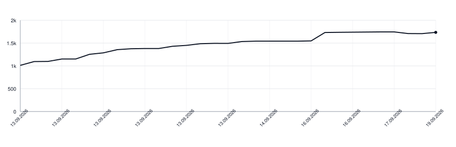

# wlmarkdown-swift

[](https://github.com/wikilayer/wlmarkdown-swift/actions/workflows/tests.yml)
[](https://wikilayer.github.io/wlmarkdown-swift/documentation/wlmarkdown/)

The Swift implementation of the WikiLayer markdown dialect. It recognises
callouts, map embeds, and `page:` and `block:` links on top of
[swift-markdown](https://github.com/swiftlang/swift-markdown). The Go package
[wlmarkdown](https://github.com/wikilayer/wlmarkdown) leads the shared rules and
test corpora.

Add the package in `Package.swift`:

```swift
.package(url: "https://github.com/wikilayer/wlmarkdown-swift.git", from: "0.7.0")
```

Then recognise structured constructs or extract reader-visible text:

```swift
import WLMarkdown

let found = Dialect().recognise("> [!TIP]\n> Try the shorter form.\n")
let plain = Dialect().plainText("Read **this** before `make test`.")
```

`recognise(_:)` returns a flat list in document order. Each `Found` value describes
a callout, map, unreadable map, or link. `plainText(_:)` removes markdown syntax for
search, previews, and indexing.

## What it recognises

A blockquote whose first line is exactly `[!NOTE]`, `[!TIP]`, `[!IMPORTANT]`,
`[!WARNING]`, or `[!CAUTION]` is a callout. A marker sharing its line with words or
written in another case leaves an ordinary quote.

A `[!MAP]` marker followed by a line of two numbers is a map embed, and whatever
follows is its caption. Both numbers are digits carrying an optional sign and an
optional fraction, and nothing else: no exponent, no hexadecimal, no infinity. They
come back as the source wrote them, digit for digit, because rounding a coordinate
moves the point.

A latitude may go as far as 90 and a longitude as far as 180. A pair outside those
bounds comes back as `kind: "unreadable"` with the words the author wrote.

A bracketed link may name a node under the `page:` or `block:` scheme. The library
reports its destination but does not resolve it against a store.

Read `markers`, `classes`, and `schemes` instead of copying the current values into
an application.

## Asking about a document you parsed yourself

`Reading` answers questions about a swift-markdown tree an application already
parsed. It must receive the same source string as the `Document`:

```swift
import Markdown

let source = "> [!MAP]\n> 44.7866, 20.4489\n> Belgrade\n"
let reading = Reading(source)
for quote in Document(parsing: source).children.compactMap({ $0 as? BlockQuote }) {
    if let place = reading.place(in: quote) {
        print(place.lat, place.lng, place.caption)
    }
}
```

`place(in:)` returns valid maps, `unreadable(in:)` returns the words of an
out-of-bounds map, and `declined(in:)` reports marked quotes the dialect left
unchanged. `opensAConstruct(_:)`, `isAutolink(_:)`, and `scheme(in:)` expose the
remaining classification rules without making the application repeat them.

## What it does not do

The library does not render constructs, decorate callouts, or resolve links. Those
choices belong to the application holding the pages.

## The corpus

`rules.yaml`, `dialect.yaml`, and `plain_text.yaml` are copies of the leading Go
port's rules and corpora. Refresh them with `make sync-corpus`; every build verifies
the copies and their answers.

## Port limitation

The shared corpus passes in Swift and Go. One difference lies outside it: Go and
the site linkify a bare URL, while swift-markdown leaves it as text and offers no
linkification option. Bracketed links behave alike.

## Documentation

The [Swift-DocC API reference](https://wikilayer.github.io/wlmarkdown-swift/documentation/wlmarkdown/)
is generated and published by GitHub Actions.

## Running it

```sh
make test          # the corpus, plus the rules tests
make lint          # swiftlint
make docs          # generate the Swift-DocC API reference
make build         # all checks and the package build
make sync-corpus   # refresh rules.yaml and both corpora from the leading port
```

Releases are published by the repository's
[Release workflow](https://github.com/wikilayer/wlmarkdown-swift/actions/workflows/release.yml),
after it repeats the complete build.

## Lines of Code

<picture>
  <source media="(prefers-color-scheme: dark)" srcset=".github/loc-history-dark.svg">
  <source media="(prefers-color-scheme: light)" srcset=".github/loc-history-light.svg">
  
</picture>
